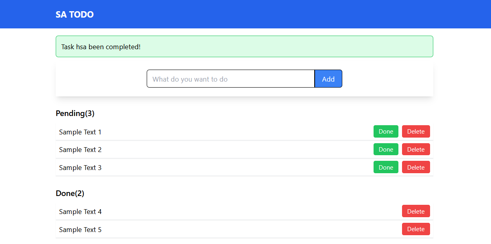

# SA TODO

## Installation Instructions:
- Download the project
- Install dependencies:
    - pip install flask
    - pip install flask python-dotenv
    - pip install pytest
- Create a .env file in the root folder of the project and enter a secret key e.g. SECRET_KEY=your_secret_key

## Run Instructions:
- Open a terminal in the project folder
- Run the app:
- python -m flask run
- Open your browser and click the link shown in the terminal e.g. `http://127.0.0.1:5000`
